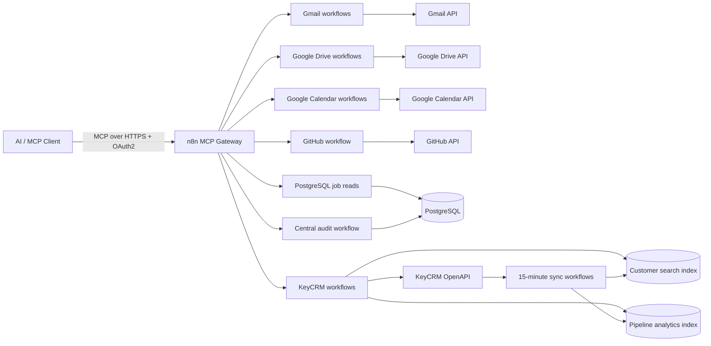

# MCP Business Operations Hub

Production-oriented, self-hosted **Model Context Protocol (MCP) gateway** that lets an AI client work with business systems through explicit, auditable, least-privilege tools instead of direct unrestricted account access.

Built with **n8n, PostgreSQL, Docker, OAuth2, Google Workspace APIs, GitHub API, and KeyCRM OpenAPI**.

Current production surface: **17 read-only MCP tools** across Gmail, Google Drive, Google Calendar, GitHub, PostgreSQL, and KeyCRM.

## What this project demonstrates

This project is a practical example of building an AI automation layer around real business systems while keeping security and operational control outside the model.

Key engineering areas:

- MCP tool design and aggregation;
- self-hosted n8n production workflows;
- OAuth2 and provider credentials;
- PostgreSQL read models and analytics indexes;
- API pagination, rate-limit handling, synchronization checkpoints, and idempotent UPSERTs;
- normalized tool contracts and error handling;
- centralized audit logging with sensitive-field redaction;
- least-privilege database and OAuth access;
- production acceptance and regression testing;
- explicit handling of provider API limitations instead of private or guessed endpoints.

## Architecture



The aggregate MCP workflow contains routing only. Provider-specific validation, authorization, normalization, and error handling stay inside isolated sub-workflows.

See [docs/ARCHITECTURE.md](docs/ARCHITECTURE.md) for the detailed design.

## Production MCP tools

### Gmail

| Tool | Purpose |
|---|---|
| `search_emails` | Search the connected mailbox and return normalized messages |
| `get_email_attachment` | Retrieve a message attachment without exposing Gmail attachment IDs to the caller |

### Google Drive

| Tool | Purpose |
|---|---|
| `search_drive_files` | Search Drive by filename or content |
| `read_drive_file` | Read supported Docs, Sheets, Slides, PDF, and text content |

### Google Calendar

| Tool | Purpose |
|---|---|
| `get_calendar_events` | Read events in an explicit time range |
| `find_free_time` | Calculate free windows from Calendar FreeBusy data |

### GitHub and PostgreSQL

| Tool | Purpose |
|---|---|
| `get_github_file` | Read a text file from the configured GitHub repository |
| `get_recent_jobs` | Inspect recent production content jobs |
| `get_job_details` | Inspect one production job and its failure context |

### KeyCRM

| Tool | Purpose |
|---|---|
| `search_customers` | Find customers by name, email, phone, or buyer ID |
| `get_customer_details` | Fetch fresh buyer details from KeyCRM |
| `get_manager_customer_stats` | Count customers assigned to a manager |
| `get_manager_call_stats` | Aggregate calls for a manager and time range |
| `get_manager_sales_stats` | Calculate lead/sales/conversion metrics |
| `get_manager_lead_stats` | Break down manager leads by source, pipeline, and status |
| `get_manager_assignment_history` | Return observed manager/source reassignment events |
| `get_manager_call_timeline` | Build a call timeline and calculate gaps between calls |

## Example business questions

The MCP client can combine small tools into higher-level answers such as:

```text
Find the latest email about a specific invoice and summarize the amount and due date.

Find a file in Google Drive, read it, and summarize the relevant section.

Show my calendar events tomorrow and find a free 60-minute window.

Why did the latest production content job fail?

Find a customer in KeyCRM and return current contact details.

How many leads did a manager receive last month, from which sources, and what was the conversion rate?

Show the manager's call timeline and the longest gaps between calls.
```

## Key architecture decisions

### 1. Read-only model-facing boundary

All currently published business tools are read-only. The model cannot silently mutate Gmail, Calendar, Drive, PostgreSQL business data, or KeyCRM records.

The PostgreSQL credential used by model-facing business reads maps to a dedicated role with:

```text
SELECT = true
INSERT = false
UPDATE = false
DELETE = false
```

### 2. Search indexes instead of full provider scans

KeyCRM remains the source of truth, but natural-language customer search and manager analytics would be inefficient if every question required full API pagination.

The system therefore maintains minimal local PostgreSQL indexes:

```text
KeyCRM -> scheduled synchronization -> PostgreSQL read models -> MCP analytics tools
```

Customer and pipeline-card synchronization runs every 15 minutes with checkpoints, overlap windows, deduplication, and UPSERT semantics.

### 3. Fresh provider reads where freshness matters

Local indexes are used only where they solve a concrete search or aggregation problem. `get_customer_details` still performs a fresh KeyCRM read after the customer is identified, and call analytics read current KeyCRM call data.

### 4. Centralized audit contract

Valid audited calls follow:

```text
validate
-> audit start
-> provider/database read
-> normalize
-> audit finish
-> return
```

Sensitive inputs such as Gmail search queries and CRM customer search text are redacted before audit storage.

### 5. Provider limitations are explicit

KeyCRM's UI contains multi-channel customer chats, but the public OpenAPI currently does not expose CRM-native communication history through a supported read endpoint or message webhook.

The project therefore does **not** scrape the UI, invent `/messages` or `/chats` endpoints, or silently represent Gmail as KeyCRM-native history. This limitation is documented in [docs/M3_KEYCRM_COMMUNICATIONS_API.md](docs/M3_KEYCRM_COMMUNICATIONS_API.md).

## Reliability work completed

Examples of production defects caught during acceptance:

- a PostgreSQL read role initially lacked `SELECT` on a newly added table; only the missing read permission was granted;
- a long KeyCRM pipeline-card bootstrap missed 22 historical records because live inserts shifted page boundaries; provider/local reconciliation detected and recovered the missing records before acceptance;
- Gmail returned no MCP response when a search had zero results; the workflow was corrected to return a normal successful empty result;
- an n8n runtime HTTP-error routing defect was fixed by upgrading the runtime rather than adding a workflow-specific bypass.

These cases are documented in the project acceptance and current-state files.

## Security model

- MCP endpoint protected by OAuth2.
- Provider secrets stay in n8n credential storage and are never committed.
- Google Drive and Calendar use dedicated read-only OAuth scopes.
- Model-facing PostgreSQL access uses a SELECT-only role.
- KeyCRM model-facing workflows use read operations only.
- Sensitive audit arguments are centrally redacted.
- Provider-specific stack traces are normalized before returning errors to the MCP client.
- Any future write tools remain a separate milestone and require an explicit approval boundary and idempotency protection.

See [docs/SECURITY.md](docs/SECURITY.md).

## Repository structure

```text
mcp-business-operations-hub/
├── README.md
├── docs/               # architecture, security, roadmap, acceptance evidence
├── n8n/                # exported production workflows
│   ├── MCP_SERVER.json
│   ├── AUDIT_TOOL_CALL.json
│   ├── calendar/
│   ├── drive/
│   ├── gmail/
│   ├── github/
│   ├── keycrm/
│   └── postgres/
├── database/           # PostgreSQL migrations
├── examples/           # sanitized portfolio examples
└── scripts/            # repository validation utilities
```

## Runtime and project status

Production n8n runtime: `2.37.10`.

Milestones:

```text
M0 Foundation                  complete
M1 Production cleanup          complete
M2 Google Workspace expansion  complete
M3 CRM integration             complete
M4 Controlled writes           deferred
M5 Portfolio hardening         in progress
```

M3 was closed on 2026-09-10. The missing KeyCRM communications API is an accepted provider limitation, not an unfinished implementation.

M4 is deliberately deferred. No write credentials or state-changing business tools are currently exposed.

Current work is M5: portfolio hardening, sanitized examples, automated export validation, deployment/runbook documentation, and demo material.

See [docs/CURRENT_STATE.md](docs/CURRENT_STATE.md) and [docs/ROADMAP.md](docs/ROADMAP.md).

## Engineering principles

1. **No ad-hoc hacks** — fix reusable system-level defects instead of one prompt or one dataset.
2. **Least privilege** — each integration receives only the permissions required for its role.
3. **Small tool contracts** — each MCP tool has a narrow, stable responsibility.
4. **Read/write separation** — state-changing operations are never hidden inside read tools.
5. **Source-grounded answers** — the model receives structured evidence from business systems.
6. **Auditable execution** — production calls are observable and normalized.
7. **Reconcile long synchronizations** — workflow success alone is not proof of dataset completeness.
8. **Do not invent provider capabilities** — unsupported interfaces remain documented limitations.
