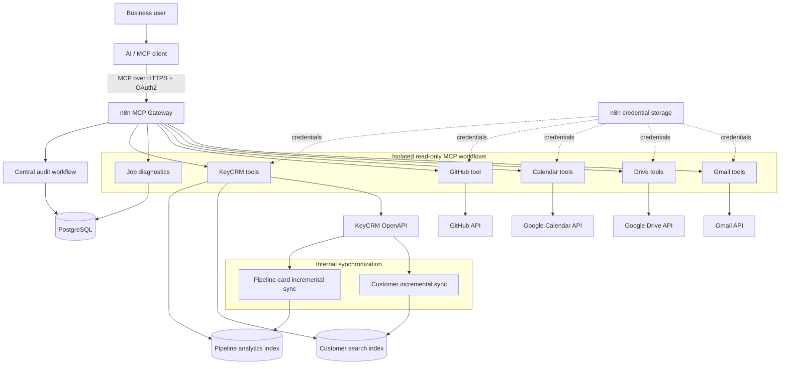

# Portfolio Architecture

This diagram presents the production design at a recruiter/interview level. Detailed implementation notes remain in `docs/ARCHITECTURE.md`.



## Design boundaries

### MCP gateway

The aggregate MCP server exposes approved tools but does not contain provider-specific business logic. Each capability is implemented as an isolated sub-workflow with its own validation and normalization.

### Read-only model-facing access

The current 17 published business tools are read-only. PostgreSQL model-facing queries use a dedicated SELECT-only role. Google Drive and Calendar use read-only OAuth scopes. KeyCRM model-facing workflows perform read operations only.

### Local PostgreSQL read models

KeyCRM remains the source of truth. PostgreSQL is used as a local search/analytics layer only where direct provider scans would be slow or rate-limit-heavy.

Two main read models are maintained:

```text
keycrm_customers
keycrm_pipeline_cards
```

The indexes are refreshed by internal synchronization workflows every 15 minutes using overlap windows, checkpoints, deduplication, and UPSERT semantics.

### Fresh reads versus indexed reads

The project deliberately chooses the correct data path per question:

```text
natural customer lookup
-> local minimal search index
-> buyer_id
-> fresh KeyCRM buyer read

manager sales/lead aggregation
-> synchronized pipeline analytics index

manager call statistics/timeline
-> fresh KeyCRM call API reads
```

### Audit and PII handling

Valid audited tool calls follow:

```text
validate
-> audit start
-> provider/database read
-> normalize
-> audit finish
-> return
```

Sensitive search arguments are redacted before storage. Provider credentials remain in n8n credential storage and are not committed to the repository.

### Provider limitation handling

KeyCRM's UI contains customer chat history, but the current public OpenAPI does not provide a supported CRM-native communications read endpoint or message webhook. The project records this as an explicit provider limitation instead of scraping the UI or inventing private endpoints.

## Current milestone state

```text
M0 Foundation                  complete
M1 Production cleanup          complete
M2 Google Workspace expansion  complete
M3 CRM integration             complete
M4 Controlled writes           deferred
M5 Portfolio hardening         in progress
```

The current portfolio stage focuses on documentation, sanitized demonstrations, repository validation, and deployment/runbook material without changing production behavior.
